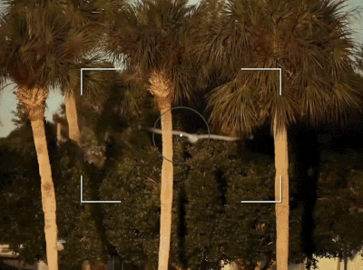

# YOLO11n Edge Bird Detector: Fine-Tuning & Knowledge Distillation

Single-class real-time bird detector engineered on **YOLO11n** (2.6M parameters). Inspired by modern camera autofocus systems (e.g., Sony AI-powered autofocus), this project explores the possibility to pushes an edge-ready architecture to match and surpass baseline general purpose **YOLO11s** and **YOLO11m** performance while remaining lightweight enough for MCU/SBC deployment (such as a Raspberry Pi).

  <strong>Modern Flagship Camera AI Tracking AF</strong>
    
  

---

## Motivation & Objectives

Birds represent a challenging computer vision target due to extreme variations in morphology, plumage patterns, pose, scale (macro close-ups vs. distant flock specks), and occlusion in foliage. 

* **Target Architecture:** `YOLO11n` (Nano) for ultra-low-power edge inference.
* **Core Benchmark:** Outperform standard baseline `YOLO11s` / `YOLO11m` on ALL metrics.
* **Methodology:** Systematic custom data curation $\to$ hyper-parameter ablation $\to$ intermediate feature knowledge distillation (KD).

---

## Dataset Engineering & Evolution

Achieving robust generalizability required building a dataset that balances taxonomy diversity, contextual backgrounds, and clean ground-truth annotations.

*[IMAGE PLACEHOLDER: Visual flow diagram showing dataset progression from NABirds (V1) to COCO-Birds (V2), Multi-Source Fusion (V3), and Final Curated Dataset (V3.1)]*

### Dataset Curation

* **V1: Cornel NABirds (5.5k images)**
  * *Characteristics:* 100% human-verified species-level taxonomy (Partial dataset 10 images $\times$ 555 classes).
  * *Limitation:* Dominated by centered wildlife portraits with single subjects. Models trained here failed on real-world scenes with scale variation, background clutter, and flocks.
* **V2: COCO Birds Only (3.3k images)**
  * *Characteristics:* Excellent real-world "in-context" complexity (literally in the name of COCO).
  * *Limitation:* Limited species diversity (over-indexed on common waterfowl, pigeons, and parrots) and insufficient dataset volume for zero-shot species generalization.
* **V3: Multi-Source Fusion (10.4k images)**
  * *Composition:* NABirds (5 images $\times$ 555 classes = 2,775) + COCO Birds (3,362) + Google Open Images V7 Human-Verified Splits (4,292).
  * *Improvement:* Realized that COCO dataset has "crowd" labels which puts one box over a flock, this is unwanted and disabled in this version.
  * *Limitation:* OIV7 "human labels" suffered from severe label noise (offensively bad), including missed foreground subjects, duplicate boxes, and spurious ground truth (e.g., bats, cooked turkeys).
* **V3.1: Final Curated Dataset (12,264 images)**
  * *Pruning:* Built a rapid GUI triage tool to filter out >100 of the worst miss-labels from OIV7.
  * *Hard Negative Mining:* Added **2,000 pure background images** (COCO negative frames: vehicles, furniture, landscapes) to aggressively suppress false-positive background activations.

---

## Training Strategy & Hyperparameter Optimization

### 1. Full-Backbone Fine-Tuning
Given the ~12.2k image volume, training was conducted with an **unfrozen backbone** (`freeze=0`) to allow low-level convolutional kernels and high-level attention heads to specialize fully on bird feature maps.

### 2. Hyperparameter & Loss Alignment
* **Optimizer Stability:** Lowered initial learning rates by an order of magnitude (`lr0=0.001` for MuSGD / `0.0001` for AdamW) to eliminate warmup shock and prevent catastrophic forgetting on pretrained weights.
* **Domain-Specific Augmentation:**
  * *Spatial Restraint:* Restricted non-physical distortions (`flipud=0.0`, `degrees=0.0`, `perspective=0.0`). Birds rarely appear inverted or geometrically sheared in field conditions.
  * *Scale Protection:* Capped `scale=0.3` and stabilized `mosaic=0.5` (`close_mosaic=0`) to prevent distant flock targets from shrinking subpixel.
  * *Occlusion Regularization:* Tuned `erasing=0.1` and subtle HSV color jitter to simulate foliage occlusion and changing outdoor lighting conditions without destroying small bounding boxes.

---

## 🔬 Knowledge Distillation Pipeline *(WIP)*

To maximize student performance without adding runtime inference latency, training incorporates feature-based Knowledge Distillation (KD):

1. **Teacher Model:** Train an optimized `YOLO11m` (Medium, ~20M params) at $640\text{px}$ using identical dataset constraints to act as a high-capacity spatial feature reference.
2. **Student Alignment:** Train `YOLO11n` using intermediate neck-layer feature alignment (`dis=6.0`), forcing the Nano student to inherit the teacher’s sharp boundary definitions and low-contrast target heatmaps.

*[IMAGE PLACEHOLDER: Diagram of Knowledge Distillation architecture illustrating feature map alignment between YOLO11m Teacher and YOLO11n Student]*

---

## 🛠️ Tech Stack & Tools

* **Frameworks:** Ultralytics YOLO11, PyTorch, CUDA
* **Hardware:** NVIDIA A100 SXM4 (Cloud Training) $\to$ Target: ARM-based Edge SBCs
* **Data Pipelines:** Python, NumPy, Matplotlib, Custom OpenCV curation tooling
