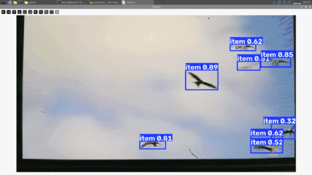
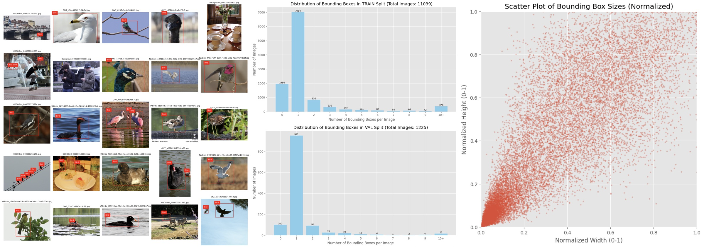
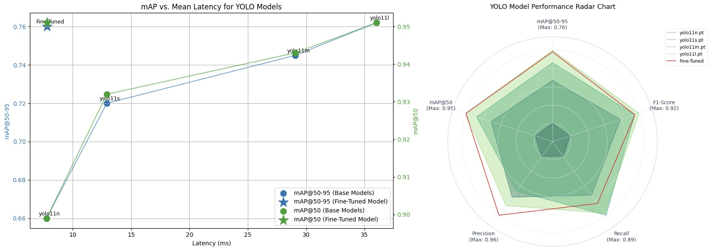

# YOLO11n Edge Bird Detector: Fine-Tuning & Knowledge Distillation

[](https://github.com/ultralytics/ultralytics)
[](https://pytorch.org/)
[]()
[](https://www.nvidia.com/)
[](https://colab.research.google.com/)
[](https://voxel51.com/fiftyone/)
[](https://www.python.org/)

Single-class real-time bird detector engineered on **YOLO11n** (2.6M parameters). Inspired by modern camera autofocus systems (e.g., Sony AI-powered autofocus).

<p align="center">
  <strong>Modern Flagship Camera AI Tracking AF</strong>
  <br><br>
  
</p>

<p align="center">
  <strong>Raspberry Pi Deploy Demo</strong>
  <br><br>
  
</p>

---

## Motivation & Objectives

This project explores the possibility of pushing a single-class edge-ready **YOLO11n** to match and surpass baseline general purpose **YOLO11s** and **YOLO11m** performance while remaining lightweight enough for MCU/SBC deployment (such as a Raspberry Pi). Birds represent a challenging computer vision target due to extreme variations in morphology, plumage patterns, pose, scale (macro close-ups vs. distant flock specks), and occlusion in foliage. 

* **Target Architecture:** `YOLO11n` (Nano) for ultra-low-power edge inference.
* **Core Benchmark:** Outperform standard baseline `YOLO11s` / `YOLO11m` on mAP50 & mAP50-95.
* **Methodology:** Systematic custom data curation $\to$ hyperparameter & augmentation ablation $\to$ intermediate feature knowledge distillation (KD).

---

## Dataset Engineering & Evolution

Achieving robust generalizability required building a dataset that balances taxonomy diversity, contextual backgrounds, and clean ground-truth annotations.

### Dataset Curation

* **V1: Cornell NABirds (5.5k images)**
  * *Characteristics:* 100% human-verified species-level taxonomy (Partial dataset 10 images $\times$ 555 classes).
  * *Limitation:* Dominated by centered wildlife portraits with single subjects. Models trained here failed on real-world scenes with scale variation, background clutter, and flocks.
* **V2: COCO Birds Only (3.3k images)**
  * *Characteristics:* Excellent real-world "in-context" complexity (literally in the name of COCO).
  * *Improvement:* Realized that COCO dataset has "crowd" labels which puts one box over a flock, this is unwanted and disabled in later versions.
  * *Limitation:* Limited species diversity (over-indexed on common waterfowl, pigeons, and parrots) and insufficient dataset volume for zero-shot species generalization.

<p align="center">
  <strong>Unwanted Flock Bounding Boxes</strong>
  <br><br>
  
</p>

* **V3: Multi-Source Fusion (10.4k images)**
  * *Composition:* NABirds (5 images $\times$ 555 classes = 2,775) + COCO Birds (3,362) + Google Open Images V7 Human-Verified Splits (4,292).
  * *Limitation:* OIV7 "human labels" suffered from severe label noise (offensively bad), including missed foreground subjects, duplicate boxes, and spurious ground truth (e.g., bats, cooked turkeys).

<p align="center">
  <strong>Horrible Labels</strong>
  <br><br>
  
</p>

* **V4: Pruning + background Dataset (12,264 images)**
  * *Pruning:* Built a rapid GUI triage tool to filter out >100 of the worst miss-labels from OIV7.
  * *Negative Mining:* Added **2,000 pure background images** (COCO negative frames: vehicles, furniture, landscapes) to aggressively suppress false-positive background activations.

<p align="center">
  <strong>Pre-Final Dataset</strong>
  <br><br>
  
</p>

* **V4.1: Targeted Patches (11,641 images)**
  * *Filter:* Notice the model's tendency to false-trigger on large "filling frame" entities, and tiny blurry dark specs. Added a filter to remove boxes that are below 0.0625% of the frame (2.5% * 2.5%), and above 97.5% width or height (closeup birds out of frame).
  * *Targeted Negative:* Sometimes trigger-happy on general subjects, swapped out random background to specific subjects like `cat`, `person`, `horse`... to ensure the detector triggers on birds, not just any subject.


---

## Fine-Tuning Strategy & Hyperparameter Optimization

### 1. Full-Backbone Fine-Tuning
Given the ~11.6k image volume, training was conducted with an **unfrozen backbone** (`freeze=0`) to allow low-level convolutional kernels and high-level attention heads to specialize fully on bird feature maps. Without any optimizations, a simple fine-tune with default parameters easily pushed both mAP 50 by `'+2%` and mAP50-95 by `'+5%`.

### 2. Hyperparameter & Loss Alignment

Most of the time training was spent on tuning hyperparameters and augmentations, these settings alone often further boosted mAP scores by`'+2%`. The nano model was used to explore and ablate as it was the fastest and therefore required less compute. 

* **Optimizer Stability:** Lowered initial learning rates by an order of magnitude (`lr0=0.001` for MuSGD / `0.0001` for AdamW) to eliminate warmup shock and prevent catastrophic forgetting on pretrained weights. MuSGD was selected as it produced ~+1% better mAP scores at the cost of slightly slower training. 
* **Domain-Specific Augmentation:**
  * *Spatial Restraint:* Restricted non-physical distortions (`flipud=0.0`, `degrees=0.0`, `perspective=0.0`). Birds rarely appear inverted or geometrically sheared in field conditions.
  * *Translation:* Enable `translate=0.1` to shift the images and prevent center bias, this turns out to be the sweet spot as any more will cause significant quality reduction (likely caused by birds being cut off)
  * *Scale Protection:* Capped `scale=0.7` and set `mosaic=1` (`close_mosaic=0`) to prevent distant flock targets from shrinking sub-pixel, while ensuring multiple instances per image.
  * *Occlusion Regularization:* Tuned `erasing=0.1` and subtle HSV color jitter to simulate foliage occlusion and changing outdoor lighting conditions without destroying small bounding boxes.

```
YOLO11n summary (fused): 101 layers, 2,582,347 parameters, 0 gradients, 6.4 GFLOPs
                 Class     Images  Instances      Box(P          R      mAP50  mAP50-95): 100% ━━━━━━━━━━━━ 19/19 4.0it/s 4.7s
                   all       1173       1476      0.952      0.884      0.947      0.755
```
---

## Knowledge Distillation Pipeline

All training used the same augmentation and hyperparameters optimized in the previous section. To maximize student performance without adding runtime inference latency, training incorporates feature-based Knowledge Distillation (KD):

1. **Teacher Model:** Train an optimized `YOLO11s` (Small, ~9M params) at $640\text{px}$ using identical dataset and augmentation to act as a high-capacity spatial feature reference. The Small size was selected based on the Ultralytics documentation recommendation (YOLO26).

```
YOLO11s summary (fused): 101 layers, 9,413,187 parameters, 0 gradients, 21.4 GFLOPs
                 Class     Images  Instances      Box(P          R      mAP50  mAP50-95): 100% ━━━━━━━━━━━━ 19/19 1.2it/s 15.3s
                   all       1173       1476      0.955      0.894      0.951      0.773
```

2. **Student Alignment:** Train `YOLO11n` using default intermediate neck-layer feature alignment (`dis=6.0`), forcing the Nano student to inherit the teacher’s sharp boundary definitions and low-contrast target heatmaps.

```
YOLO11n summary (fused): 101 layers, 2,582,347 parameters, 0 gradients, 6.4 GFLOPs
                 Class     Images  Instances      Box(P          R      mAP50  mAP50-95): 100% ━━━━━━━━━━━━ 19/19 1.6it/s 11.7s
                   all       1173       1476      0.961      0.874       0.95       0.76
```

This resulted in `+0.3%` and `+0.5%` in mAP50 and mAP50-95 respectively. 

---


## Empirical Results & Standalone Benchmarks

### Validation Setup
To evaluate real-world generalizability, models were benchmarked on the balanced **1,173-image validation set** separate from the training set. Specifically, the COCO portion of the `val` set also came from the validation set of COCO, ensuring a fair comparison.

### Performance Comparison

<div align="center">

  | Model      | Precision   | Recall   | mAP@50   | mAP@50-95   | Total Pipeline (ms)   | FPS   |
  |:-----------|:------------|:---------|:---------|:------------|:----------------------|:------|
  | yolo11n.pt | 0.912       | 0.806    | 0.899    | 0.66        | 7.75                  | 129   |
  | yolo11s.pt | 0.946       | 0.862    | 0.932    | 0.72        | 12.92                 | 77.4  |
  | yolo11m.pt | 0.941       | 0.891    | 0.943    | 0.745       | 29.08                 | 34.4  |
  | yolo11l.pt | 0.953       | 0.888    | 0.951    | 0.762       | 36.03                 | 27.8  |
  | Fine-Tuned | 0.961       | 0.874    | 0.951    | 0.76        | 7.81                  | 128   |
  
</div>


<p align="center">
  <strong>Benchmark Results</strong>
  <br><br>
  
</p>

---

## Key Takeaways & Architecture Analysis

### 1. Defeating the Target Baseline (`YOLO11s`) Across the Board
* **Objective Exceeded:** The original design target was to bridge the gap to `YOLO11s`. The distilled Nano model outright exceeded it across every evaluation metric, boosting **Precision (`+1.5%`)**, **Recall (`+1.2%`)**, **mAP@50 (`+1.8%`)**, and **mAP@50-95 (`+4.0%`)**.
* **Edge Efficiency:** This performance gain comes alongside no loss in overall latency, unlocking a sustained **$128\text{ FPS}$** pipeline suitable for real-time edge hardware.

### 2. Surpassing `YOLO11m` on mAP
* **Reach-Goal Achieved:** The distilled Nano beat standard `YOLO11m` in both **mAP@50 (`0.951` vs `0.943`)** and **mAP@50-95 (`0.760` vs `0.745`)**, running at nearly **$4\times$ the frame rate ($128\text{ FPS}$ vs $34.4\text{ FPS}$)**.
* **The Recall vs. Precision Behavior:** While the model achieved superior Precision (**`0.961` vs `0.941`**), it showed lower default snapshot Recall (**`0.874` vs `0.891`**). Knowledge distillation calibrated the student head to avoid false-positive background triggers, outputting conservative probabilities on heavily occluded instances. 
* **Operational Flexibility:** In real-time tracking applications, dropping the deployment cutoff to `conf = 0.4` unlocks **`0.891` recall at `0.942` precision**, which matches/exceeds Medium's coverage while maintaining a massive speed advantage.

```
Conf    Precision   Recall      F1          mAP@50      mAP@50-95
-----------------------------------------------------------------
0.30    0.917       0.900       0.909       0.950       0.758       
0.33    0.928       0.897       0.912       0.950       0.758       
0.35    0.934       0.894       0.913       0.950       0.758       
0.38    0.941       0.892       0.916       0.950       0.758       
0.40    0.942       0.891       0.916       0.950       0.758       
0.42    0.945       0.888       0.915       0.950       0.758       
0.45    0.949       0.883       0.915       0.950       0.758       
0.47    0.953       0.880       0.915       0.950       0.758       
0.50    0.959       0.876       0.916       0.950       0.758   
-----------------------------------------------------------------
Max F1 at Conf = 0.55: Precision = 0.970 | Recall = 0.871 | F1 = 0.918
```

### 3. Matching the `YOLO11l`
* **Pleasant surprise:** While never the goal (or thought possible), the distilled Nano achieved parity with the **$25.3\text{M}$ parameter `YOLO11l`** on **mAP@50 (`0.951`)** and effectively matched its high-IoU localization on **mAP@50-95 (`0.760` vs `0.762`)**.
* **Compute Compression:**
  * **Parameter Footprint:** $2.58\text{M}$ vs $25.3\text{M}$ ($\sim 90\%$ reduction)
  * **Pipeline Latency:** $7.81\text{ ms}$ vs $36.03\text{ ms}$ ($4.6\times$ throughput speedup)
* **Conclusion:** For dedicated single-class embedded vision (e.g., camera autofocus tracking, wildlife traps, drone vision), architectural scale can be substituted with targeted data cleaning and teacher-student distillation without sacrificing bounding-box accuracy.


---


## Code

[Link to training Colab (Data included)](https://colab.research.google.com/drive/1wiaEctOBlE-s_Pyq4gjT5Fblmw-k7mvq?usp=sharing)
