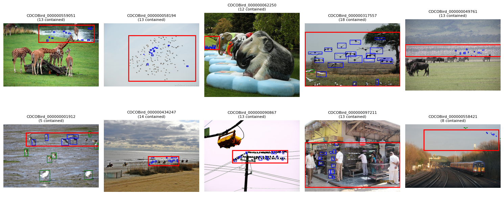
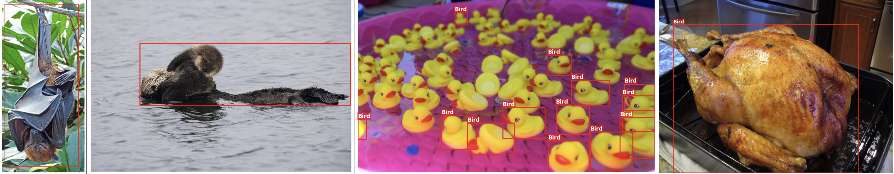
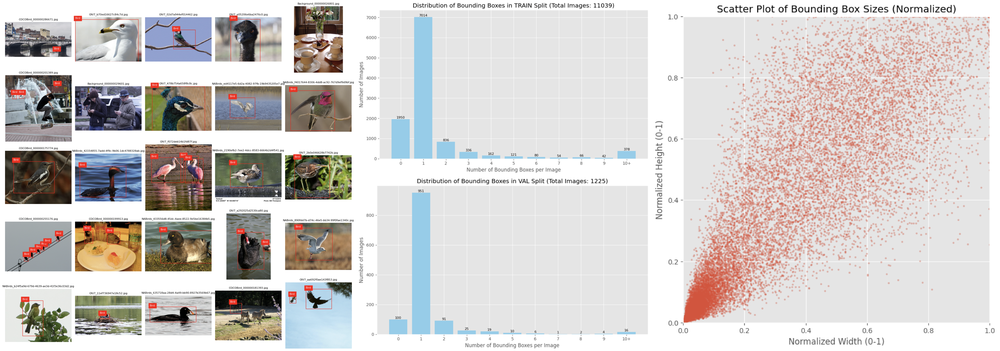

# YOLO11n Edge Bird Detector: Fine-Tuning & Knowledge Distillation

Single-class real-time bird detector engineered on **YOLO11n** (2.6M parameters). Inspired by modern camera autofocus systems (e.g., Sony AI-powered autofocus).

  <strong>Modern Flagship Camera AI Tracking AF</strong>
    
  

---

## Motivation & Objectives

This project explores the possibility of pushing a single-class edge-ready **YOLO11n** to match and surpass baseline general purpose **YOLO11s** and **YOLO11m** performance while remaining lightweight enough for MCU/SBC deployment (such as a Raspberry Pi). Birds represent a challenging computer vision target due to extreme variations in morphology, plumage patterns, pose, scale (macro close-ups vs. distant flock specks), and occlusion in foliage. 

* **Target Architecture:** `YOLO11n` (Nano) for ultra-low-power edge inference.
* **Core Benchmark:** Outperform standard baseline `YOLO11s` / `YOLO11m` on mAP50 & mAP50-95.
* **Methodology:** Systematic custom data curation $\to$ hyperparameter & augmentation ablation $\to$ intermediate feature knowledge distillation (KD).

---

## Dataset Engineering & Evolution

Achieving robust generalizability required building a dataset that balances taxonomy diversity, contextual backgrounds, and clean ground-truth annotations.

### Dataset Curation

* **V1: Cornell NABirds (5.5k images)**
  * *Characteristics:* 100% human-verified species-level taxonomy (Partial dataset 10 images $\times$ 555 classes).
  * *Limitation:* Dominated by centered wildlife portraits with single subjects. Models trained here failed on real-world scenes with scale variation, background clutter, and flocks.
* **V2: COCO Birds Only (3.3k images)**
  * *Characteristics:* Excellent real-world "in-context" complexity (literally in the name of COCO).
  * *Improvement:* Realized that COCO dataset has "crowd" labels which puts one box over a flock, this is unwanted and disabled in later versions.
  * *Limitation:* Limited species diversity (over-indexed on common waterfowl, pigeons, and parrots) and insufficient dataset volume for zero-shot species generalization.

  <strong>Unwanted Flock Bounding Boxes</strong>
    
  

* **V3: Multi-Source Fusion (10.4k images)**
  * *Composition:* NABirds (5 images $\times$ 555 classes = 2,775) + COCO Birds (3,362) + Google Open Images V7 Human-Verified Splits (4,292).
  * *Limitation:* OIV7 "human labels" suffered from severe label noise (offensively bad), including missed foreground subjects, duplicate boxes, and spurious ground truth (e.g., bats, cooked turkeys).

  <strong>Horrible Labels</strong>
    
  

* **V4: Pruning + background Dataset (12,264 images)**
  * *Pruning:* Built a rapid GUI triage tool to filter out >100 of the worst miss-labels from OIV7.
  * *Negative Mining:* Added **2,000 pure background images** (COCO negative frames: vehicles, furniture, landscapes) to aggressively suppress false-positive background activations.

  <strong>Pre-Final Dataset</strong>
    
  

* **V4.1: Targeted Patches**
  * *Filter:* Notice the model's tendency to false-trigger on large "filling frame" entities, and tiny blurry dark specs. Added a filter to remove boxes that are below 0.0625% of the frame (2.5% * 2.5%), and above 97.5% width or height (closeup birds out of frame).
  * *Targeted Negative:* Sometimes trigger-happy on general subjects, swapped out random background to specific subjects like `cats`, `human`, `horse`, to ensure the detector triggers on birds, not just any subject.

---

## Fine-Tuning Strategy & Hyperparameter Optimization

### 1. Full-Backbone Fine-Tuning
Given the ~12.2k image volume, training was conducted with an **unfrozen backbone** (`freeze=0`) to allow low-level convolutional kernels and high-level attention heads to specialize fully on bird feature maps.

### 2. Hyperparameter & Loss Alignment
* **Optimizer Stability:** Lowered initial learning rates by an order of magnitude (`lr0=0.001` for MuSGD / `0.0001` for AdamW) to eliminate warmup shock and prevent catastrophic forgetting on pretrained weights. MuSGD was selected as it produced ~+1% better mAP scores at the cost of slightly slower training. 
* **Domain-Specific Augmentation:**
  * *Spatial Restraint:* Restricted non-physical distortions (`flipud=0.0`, `degrees=0.0`, `perspective=0.0`). Birds rarely appear inverted or geometrically sheared in field conditions.
  * *Scale Protection:* Capped `scale=0.5` and stabilized `mosaic=0.6` (`close_mosaic=0`) to prevent distant flock targets from shrinking subpixel.
  * *Occlusion Regularization:* Tuned `erasing=0.1` and subtle HSV color jitter to simulate foliage occlusion and changing outdoor lighting conditions without destroying small bounding boxes.

---

## Empirical Results & Standalone Benchmarks

### Validation Setup
To evaluate real-world generalizability, models were benchmarked on a balanced **1,225-image validation set** comprising:
* **125 images:** COCO 2017 `val` split (pure in-context bird instances)
* **1,000 images:** Stratified random sample from NABirds and Open Images V7
* **100 images:** Pure background negatives (urban, indoor, and landscape scenes)

Inference latency was benchmarked at native $640\text{px}$ resolution on an **Intel(R) Xeon(R) CPU @ 2.00GHz**.

### Performance Comparison

| Model | Parameters | Precision ($P$) | Recall ($R$) | mAP@50 | mAP@50-95 | Inference Time (ms) |
| :--- | :---: | :---: | :---: | :---: | :---: | :---: |
| **YOLO11n (COCO Baseline)** | 2.6M | 0.904 | 0.735 | 0.834 | 0.610 | 124.78 |
| **YOLO11s (COCO Baseline)** | 9.4M | 0.936 | 0.789 | 0.874 | 0.667 | 330.12 |
| **YOLO11m (COCO Baseline)** | 20.0M | 0.941 | 0.818 | 0.888 | 0.693 | 954.92 |
| **YOLO11l (COCO Baseline)** | 25.3M | 0.953 | 0.817 | 0.901 | 0.711 | 1225.71 |
| **YOLO11n (Fine-Tuned)** | **2.6M** | **0.947** | **0.805** | **0.886** | **0.700** | **139.14** |

### Key Takeaways

* **Decisive Victory Over YOLO11s:** The fine-tuned Nano model comfortably outperforms the 3.6× larger baseline **YOLO11s** across every single metric, including a **$+3.3\%$ gain in strict localization ($\text{mAP@50-95}$)** while running at **more than double the framerate** ($139.14\text{ ms vs. } 330.12\text{ ms}$).
* **Punching Above Its Weight Class (Matching YOLO11m):** While the original objective was simply to exceed Small-tier accuracy, the optimized Nano model directly rivals and beats the **$20.0\text{M}$ parameter YOLO11m** in both Precision ($0.947\text{ vs. } 0.941$) and bounding box IoU quality ($\text{mAP@50-95: } 0.700\text{ vs. } 0.693$)—delivering this performance at **$6.8\times$ the inference speed** with an **$87\%$ parameter reduction**.
* **Next Milestone — Distillation Beyond YOLO11m:** With standalone fine-tuning having saturated Nano's architectural capacity at $640\text{px}$, the next phase leverages **feature-based Knowledge Distillation** from the Medium teacher to bridge the remaining recall gap and push Nano toward **YOLO11l ($25.3\text{M}$ params)** localization accuracy on edge silicon.

---

## Knowledge Distillation Pipeline *(WIP)*

To maximize student performance without adding runtime inference latency, training incorporates feature-based Knowledge Distillation (KD):

1. **Teacher Model:** Train an optimized `YOLO11m` (Medium, ~20M params) at $640\text{px}$ using identical dataset constraints to act as a high-capacity spatial feature reference.
2. **Student Alignment:** Train `YOLO11n` using intermediate neck-layer feature alignment (`dis=6.0`), forcing the Nano student to inherit the teacher’s sharp boundary definitions and low-contrast target heatmaps.

---

## Code

[Link to training Colab (Data included)](https://colab.research.google.com/drive/1wiaEctOBlE-s_Pyq4gjT5Fblmw-k7mvq?usp=sharing)
